<p align="center">
  
</p>

<h1 align="center">Address</h1>

<p align="center">A self-hosted address and synthetic test-profile generator for 27 countries and regions.</p>

<p align="center">
  <a href="README.md">English</a> ·
  <a href="README.zh-CN.md">简体中文</a> ·
  <a href="README.zh-TW.md">繁體中文</a>
</p>

<p align="center">
  <a href="https://github.com/daimon3332/address/actions/workflows/ci.yml"></a>
  <a href="https://github.com/daimon3332/address/releases"></a>
  <a href="https://nodejs.org/"></a>
  <a href="LICENSE"></a>
  <a href="https://address.333186.xyz"></a>
</p>

Address combines real open-data streets, administrative areas, coordinates, and postcodes with clearly marked synthetic indoor details. It produces source-language, English, and Simplified-Chinese address presentations plus coherent profile fields for form and software testing.

> Generated records are test data. They do not prove deliverability, residency, identity, payment-account validity, or ownership.

## 🚀 Workflow

Choose a country and location → select ordinary or evidence-backed residential mode → generate an address and test profile → copy individual fields or export the result.

## ✨ Features

- Covers 27 countries and regions with region, city, and postcode filters.
- Uses exact → nearby → same-region → nationwide fallback for synchronized countries.
- Supports IP-nearby generation with a local SQLite RTree fallback.
- Presents addresses in the source language, English, and Simplified Chinese.
- Separates source-backed address components from labeled synthetic indoor fields.
- Generates coherent basic profile, sandbox card, employment, finance, and network fields.
- Provides Google coordinate preview, address search, and an AMap link for China.
- Hot-reloads a custom blacklist and preserves evidence/source attribution.
- Supports resumable initial imports, daily country rotation, quality gates, and storage limits.

## 🧭 Address Sources and Field Provenance

The default synchronized pool uses the following source family for each country. Live providers may be used only when the corresponding mode and credential are enabled; they do not replace the default offline pool.

| Country / region | Default source | Real/source-backed address fields | Generated/synthetic address fields |
|---|---|---|---|
| United States (US) | [Overture Maps](https://overturemaps.org/) | House number, street, city, state, ZIP, source geometry | None for ordinary records; missing apartment details may generate `Apt`/room |
| Canada (CA) | [Overture Maps](https://overturemaps.org/) | House number, street, city, province, postal code, source geometry | None for ordinary records; missing apartment details may generate `Unit`/room |
| Mexico (MX) | [Overture Maps](https://overturemaps.org/) | House number, street, municipality, state, postcode, source geometry | None for ordinary records; missing apartment details may be generated |
| United Kingdom (GB) | [Geofabrik OSM](https://download.geofabrik.de/) | House number, street, town, postcode, source geometry | None for ordinary records; missing apartment details may generate `Flat` |
| Germany (DE) | [Overture Maps](https://overturemaps.org/) | House number, street, city, postcode, source geometry | None for ordinary records; missing apartment details may be generated |
| France (FR) | [Overture Maps](https://overturemaps.org/) | House number, street, city, postcode, source geometry | None for ordinary records; missing apartment details may be generated |
| Italy (IT) | [Overture Maps](https://overturemaps.org/) | House number, street, city, region, postcode, source geometry | None for ordinary records; missing apartment details may be generated |
| Spain (ES) | [Overture Maps](https://overturemaps.org/) | House number, street, city, province, postcode, source geometry | None for ordinary records; missing apartment details may be generated |
| Netherlands (NL) | [Overture Maps](https://overturemaps.org/) | House number, street, city, postcode, source geometry | None for ordinary records; missing apartment details may be generated |
| Russia (RU) | [Geofabrik OSM](https://download.geofabrik.de/) | House number, street, city, federal subject, postcode, source geometry | None for ordinary records; missing apartment details may be generated |
| China (CN) | [Geofabrik OSM](https://download.geofabrik.de/) | Province/municipality, city, district, road, source geometry; nearby named OSM community when available | House number; lexicon community fallback; missing building/unit/room details |
| Hong Kong (HK) | [Geofabrik OSM](https://download.geofabrik.de/) | Building/street, district, area, source geometry | Missing floor/flat/room details may be generated |
| Taiwan (TW) | [Overture Maps](https://overturemaps.org/) | House number, street, city/county, district, postcode, source geometry | None for ordinary records; missing apartment details may be generated |
| Japan (JP) | [Overture Maps](https://overturemaps.org/) | Block/house number, street, municipality, prefecture, postcode, source geometry | None for ordinary records; missing apartment room details may be generated |
| South Korea (KR) | [Geofabrik OSM](https://download.geofabrik.de/) | Road, building number, district, city/province, postcode, source geometry | Missing building/unit/room details may be generated |
| Singapore (SG) | [Geofabrik OSM](https://download.geofabrik.de/) | House number, street, locality, postcode, source geometry | Missing apartment unit may be generated |
| Vietnam (VN) | [Geofabrik OSM](https://download.geofabrik.de/) | House number, street, district, city, province, postcode, source geometry | None for ordinary records; missing apartment details may be generated |
| Thailand (TH) | [Geofabrik OSM](https://download.geofabrik.de/) | House number, street, city, province, postcode, source geometry | None for ordinary records; missing apartment details may be generated |
| Philippines (PH) | [Geofabrik OSM](https://download.geofabrik.de/) | House number, street, barangay/district, city, region, postcode, source geometry | None for ordinary records; missing apartment details may be generated |
| Malaysia (MY) | [Geofabrik OSM](https://download.geofabrik.de/) | House number, street, district, city, state, postcode, source geometry | None for ordinary records; missing apartment details may be generated |
| India (IN) | [Geofabrik OSM](https://download.geofabrik.de/) | House number, street, district, city, state, postcode, source geometry | None for ordinary records; missing apartment details may be generated |
| Australia (AU) | [Overture Maps](https://overturemaps.org/) | House number, street, suburb, state, postcode, source geometry | None for ordinary records; missing apartment details may be generated |
| Türkiye (TR) | [Geofabrik OSM](https://download.geofabrik.de/) | House number, street, city, province, postcode, source geometry | None for ordinary records; missing apartment details may be generated |
| Saudi Arabia (SA) | [Geofabrik OSM](https://download.geofabrik.de/) | House number, street, city, postcode, source geometry | None for ordinary records; missing apartment details may be generated |
| Brazil (BR) | [Geofabrik OSM](https://download.geofabrik.de/) | House number, street, city, state, postcode, source geometry | None for ordinary records; missing apartment details may be generated |
| Nigeria (NG) | [Geofabrik OSM](https://download.geofabrik.de/) | House number, street, city, state, postcode, source geometry | None for ordinary records; missing apartment details may be generated |
| South Africa (ZA) | [Geofabrik OSM](https://download.geofabrik.de/) | House number, street, suburb, postcode, source geometry | None for ordinary records; missing apartment details may be generated |

`None for ordinary records` means the street-level address fields are not invented; an apartment record can still receive a synthetic indoor field when the source has no official unit.

### Real and synthetic fields

| Field | Provenance |
|---|---|
| Country, region, city, district, and street | Source-backed and normalized from the address record; missing administrative labels may be filled from the local catalog. |
| House number | Source-backed for non-China countries. China intentionally replaces it with a deterministic test number. |
| Postcode | Uses a valid source postcode when available; invalid or missing values may be filled from the nearest catalog entry. |
| Coordinates | Copied from the source geometry. Depending on the source, this may be an address point, building point, or the centroid of an OSM way. |
| Building or community | Uses a source value when present. For China, a nearby named OSM residential community is preferred; the bundled lexicon is only the no-coverage fallback. |
| Apartment, building, unit, and room | Keeps official/source-tagged values when present. Missing indoor details may be generated for China and apartment records in other countries. |
| Name, phone, email, employment, finance, network, and sandbox card | Synthetic test data. |

China therefore means **real administrative and road context plus a source coordinate, with a synthetic house number and possible synthetic indoor details**. The other countries keep source house numbers, while missing apartment/unit details may still be generated. `verified` means that source evidence and project quality checks passed; it does not mean that the address is current, occupied, or deliverable.

### Google Maps and AMap behavior

- **Google coordinate preview** opens `latitude,longitude` from the source geometry. It is a location preview, not a Google delivery or occupancy certificate.
- **Google address search** uses only the address skeleton. Synthetic China house numbers, community names, and indoor units are excluded from that query; non-China searches use source-backed house number, street, locality, region, and postcode.
- **AMap** is generated only for China. The source WGS-84 coordinate is converted to GCJ-02 before opening the AMap marker URL.
- A map pin may represent an address point, building centroid, or way centroid rather than an entrance or room. The default generation path does not claim that a Google Geocoding result has independently verified every record.

For detailed field examples and source notes, see [address formats](docs/address-formats.md), [data sources](docs/data-sources.md), and the [API documentation](docs/API.md).

## 🖼️ Webui Preview (Webui 预览)

<details>
<summary>View the complete United States and China WebUI preview</summary>

<br />

<table>
  <tr>
    <th width="50%">United States</th>
    <th width="50%">China</th>
  </tr>
  <tr>
    <td>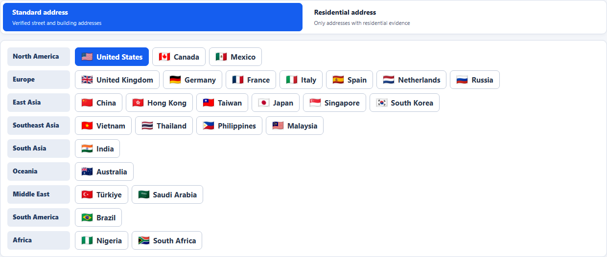</td>
    <td>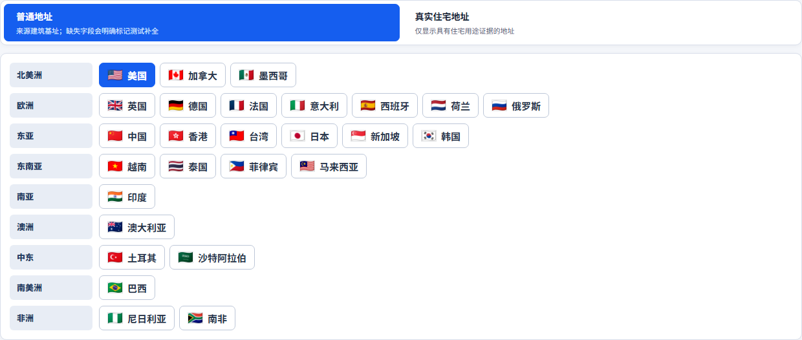</td>
  </tr>
  <tr>
    <th>Generator</th>
    <th>Generator</th>
  </tr>
  <tr>
    <td>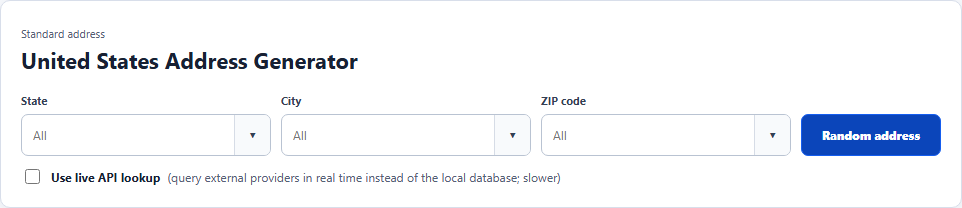</td>
    <td></td>
  </tr>
  <tr>
    <th>Address</th>
    <th>Address</th>
  </tr>
  <tr>
    <td>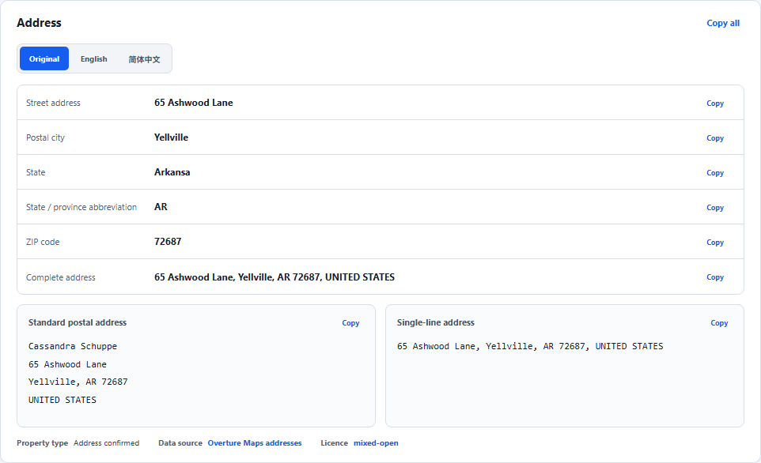</td>
    <td>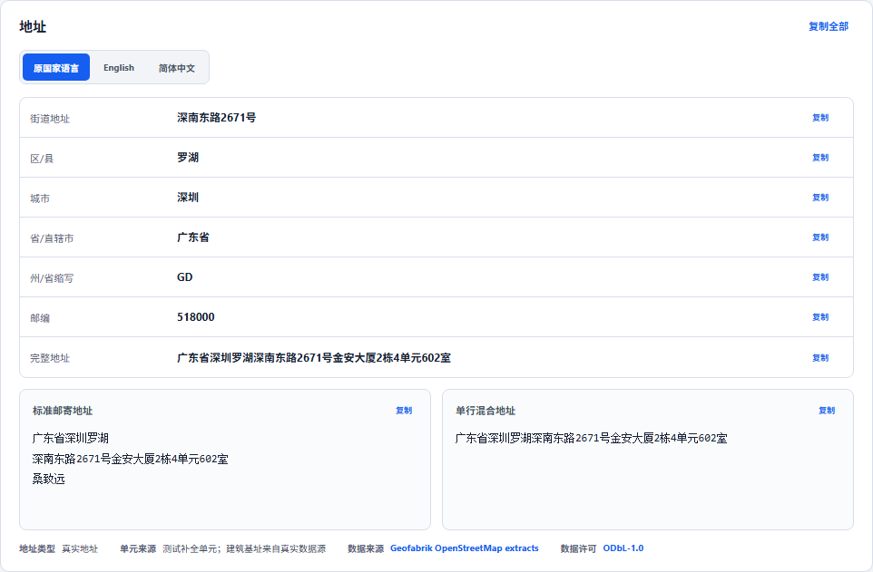</td>
  </tr>
  <tr>
    <th>Basic profile</th>
    <th>Basic profile</th>
  </tr>
  <tr>
    <td></td>
    <td></td>
  </tr>
  <tr>
    <th>Sandbox card</th>
    <th>Sandbox card</th>
  </tr>
  <tr>
    <td>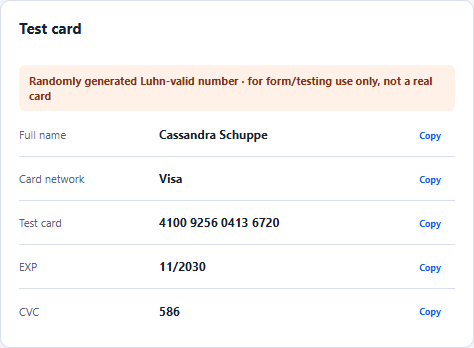</td>
    <td></td>
  </tr>
  <tr>
    <th>Employment</th>
    <th>Employment</th>
  </tr>
  <tr>
    <td></td>
    <td>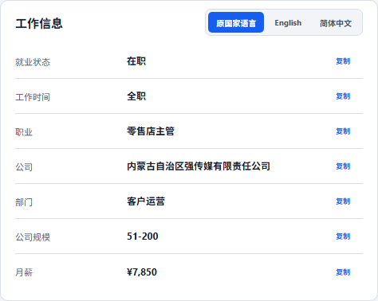</td>
  </tr>
  <tr>
    <th>Finance</th>
    <th>Finance</th>
  </tr>
  <tr>
    <td>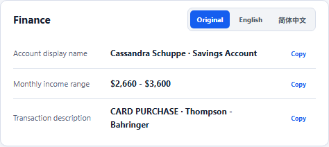</td>
    <td></td>
  </tr>
  <tr>
    <th>Network and extended fields</th>
    <th>Network and extended fields</th>
  </tr>
  <tr>
    <td>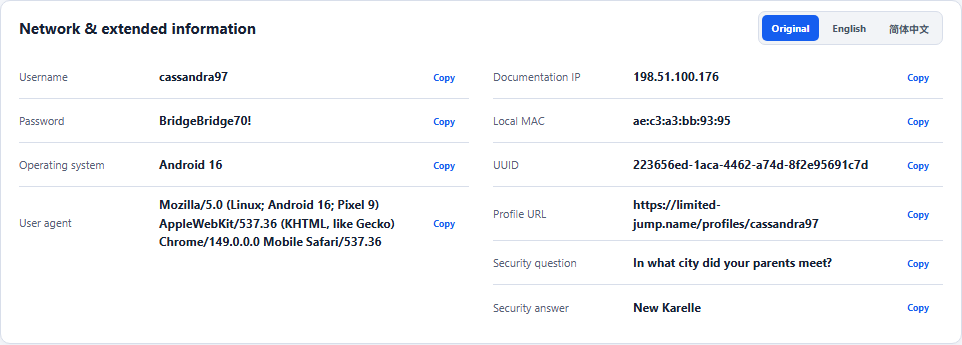</td>
    <td>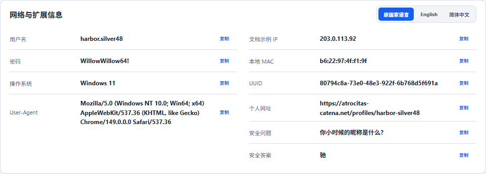</td>
  </tr>
  <tr>
    <th>Google Maps</th>
    <th>Google Maps</th>
  </tr>
  <tr>
    <td>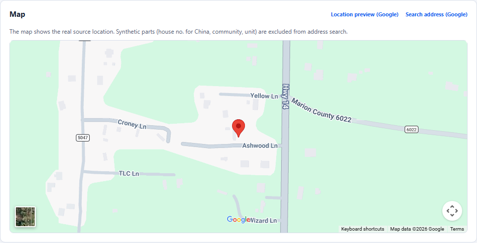</td>
    <td>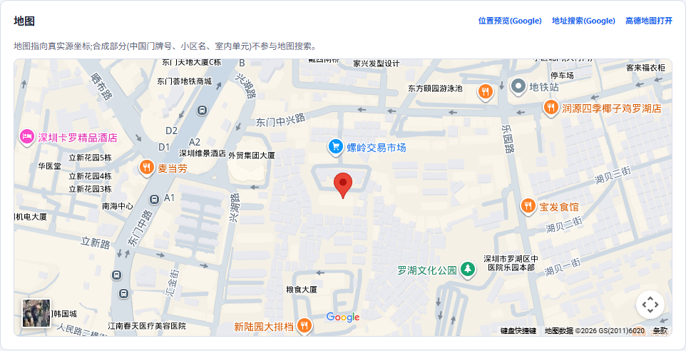</td>
  </tr>
</table>

</details>

## 📚 Documentation

| Document | Contents |
|---|---|
| [API documentation](docs/API.md) | Public endpoints, parameters, errors, sync management, CORS, and examples |
| [Deployment documentation](docs/DEPLOYMENT.md) | API keys, private configuration, VPS, Nginx, synchronization, backup, and capacity |
| [Development documentation](docs/DEVELOPMENT.md) | Architecture, local setup, data pipeline, extension points, tests, and release gates |

## ⚡ Quick start

Node.js 24 or newer is required.

```bash
git clone https://github.com/daimon3332/address.git
cd address
cp .env.example .env
npm ci
npm run db:migrate
npm run dev
```

A new database contains schema only. Run `npm run data:address-pool:bootstrap` for the resumable 27-country import. See the [deployment guide](docs/DEPLOYMENT.md) before running a production VPS.

## 🔑 Configuration summary

Offline generation and data synchronization need no third-party API key. AMap, Geoapify, Youdao, and OneMap credentials enable optional live-provider features; `SYNC_ADMIN_TOKEN` protects VPS synchronization control. Put real values only in ignored `.env`, `.deploy.env`, or `/root/address/runtime/address.env` files. Never add credentials to source, browser code, screenshots, issues, or CI logs.

## 💾 Database size

Measured after all 27 countries were synchronized on 2026-07-23 at commit `084805e`:

| Item | Measured size |
|---|---:|
| `address.sqlite` | 6.90 GiB |
| Complete `data/` directory | 7.89 GiB |
| Initial-import peak | About 11.2 GiB |

Actual size varies with upstream releases and WAL activity. A production application volume of at least **60 GiB** is recommended for synchronization, backups, and recovery space.

## 🌍 Coverage

United States, Canada, Mexico, United Kingdom, Germany, France, Italy, Spain, Netherlands, Russia, China, Hong Kong, Taiwan, Japan, South Korea, Singapore, Vietnam, Thailand, Philippines, Malaysia, India, Australia, Turkey, Saudi Arabia, Brazil, Nigeria, and South Africa.

## Data, privacy, and license

- [Overture Maps](https://overturemaps.org/) provides selected address records with source-specific metadata and terms.
- [OpenStreetMap](https://www.openstreetmap.org/copyright) and [Geofabrik](https://download.geofabrik.de/) provide other source data under ODbL 1.0.
- Client IP is used only for a requested location lookup and is not written to the address database.
- Indoor details, profiles, and card fields are synthetic test data.

Project code is released under the [MIT License](LICENSE). Redistributed data remains subject to its source licenses, attribution, and share-alike terms. The repository and releases contain no production database or private credentials.
