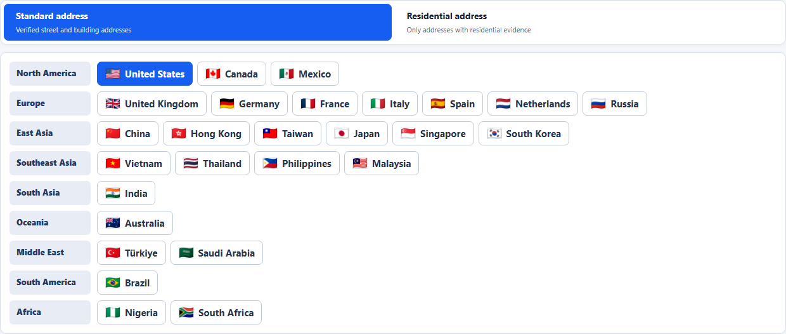
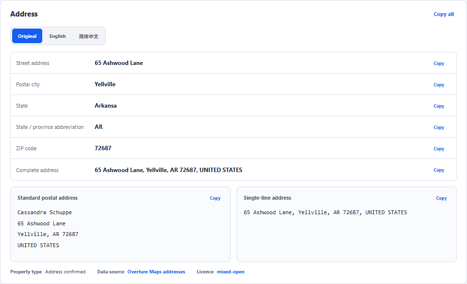

<div align="center">


# Address

**Self-hosted real-address generator backed by official registries and open map data for 27 countries and regions**

English · [简体中文](README.zh-CN.md) · [繁體中文](README.zh-TW.md)

[](https://github.com/daimon3332/address/actions/workflows/ci.yml)
[](https://hub.docker.com/r/daimon23/address)
[](https://nodejs.org/)
[](https://www.postgresql.org/)
[](LICENSE)
[](https://address.333186.xyz)

</div>



## Overview

Address returns addresses that actually exist instead of randomly assembled strings. Every record comes from an official address register, open map data, or a validated geocoding result, and carries its source, precision, and coordinates. Missing fields stay empty; nothing is invented.

Use it for form and checkout testing, address-format validation, logistics demos, and anywhere an address must look real and be real.

## Features

- **27 countries and regions** – Region, city, district, and postcode filters that follow each country's real administrative hierarchy. A filter with no data returns an error instead of silently switching to another area.
- **Traceable sources** – Residential communities for China; premise- and street-level addresses elsewhere, labelled with precision and residential evidence.
- **Ten display languages** – Native, English, Simplified and Traditional Chinese, Japanese, Korean, German, French, Spanish, and Portuguese.
- **Hands-off synchronization** – Incremental imports with bounded retries, exponential backoff, quota waits, and source-exhaustion detection, so failing work is never repeated forever.
- **Admin console** – Dashboard, country workspace, sync history, quick locations, provider credentials, translation routing, access control, and API tokens.
- **Open API** – Bearer-authenticated JSON API for single and batch generation, location search, coverage, and address translation, with an OpenAPI 3.1 document.
- **Single-file deployment** – One Docker Compose file runs the app, PostgreSQL, migrations, and the sync service; internal secrets are generated and persisted automatically.

## Quick start

### Requirements

- Linux (AMD64 or ARM64)
- Docker Engine 24+ with Docker Compose v2
- 4 GB RAM (8 GB or more recommended for the first import of large countries)

### Deploy with Docker Compose

```bash
# 1. Create a deployment directory and download the Compose file
mkdir address && cd address
curl -fsSLo docker-compose.yml https://raw.githubusercontent.com/daimon3332/address/main/docker-compose.yml

# 2. Start all services
docker compose up -d

# 3. Check readiness
docker compose ps
curl -fsS http://127.0.0.1:8787/api/v1/ready
```

On first start the stack:

- creates persistent `data/` and `runtime/` directories next to the Compose file;
- generates the database password, configuration encryption key, and service tokens in `data/secrets/`;
- runs database migrations, then starts the API and the sync service.

### First sign-in

1. Open `http://127.0.0.1:8787/admin/` and sign in with the initial password `admin`.
2. Change the administrator password when prompted.
3. Decide under **Access & Security** whether the public generator needs a password.
4. Create an API token under **API Tokens** for external clients.

> To start with your own password, set `ADMIN_INITIAL_PASSWORD` before the first `docker compose up -d`.

### Go public

The API listens on `127.0.0.1:8787` only. Put it behind an HTTPS reverse proxy and create a `.env` next to the Compose file:

```dotenv
ALLOWED_ORIGINS=https://address.example.com
TRUST_PROXY=true
COOKIE_SECURE=true
```

See the [deployment guide](docs/DEPLOYMENT.md) for Nginx and Caddy examples, upgrades, backups, and restores.

## Usage

### Web

Open `http://127.0.0.1:8787/`, pick a country, area, and display language, and generate. Results can be copied, exported, saved to favorites, or opened in Google Maps or AMap.

### API

```bash
curl -fsS "http://127.0.0.1:8787/api/v1/generate?country=US&city=Seattle" \
  -H "Authorization: Bearer YOUR_API_TOKEN"
```

```json
{
  "data": {
    "country": "US",
    "filters": { "city": "Seattle" },
    "filterMatchLevel": "exact",
    "result": {
      "address": {
        "formattedAddress": "4019 Aikins Avenue Southwest, Seattle, WA, 98116",
        "matchLevel": "premise",
        "propertyType": "residential",
        "coordinates": { "latitude": 47.567944, "longitude": -122.40706 }
      }
    }
  }
}
```

The response is abridged. `matchLevel` is the address precision (`street`, `premise`, or `subpremise`); `propertyType` is `residential` only when independent residential evidence exists. See the [API reference](docs/API.md) for every endpoint, parameter, and error code.

### Provider keys (optional)

The service runs without any third-party key, using open sources that need no authorization. China map platforms, Google Geocoding, and translation services only extend data for specific countries or enable online translation; add them under **Map Keys** in the admin console. See [API keys](docs/API_KEYS.md) for how to obtain each one.

## Screenshots

<table>
  <tr><th>Admin · Dashboard</th><th>Admin · Country workspace</th></tr>
  <tr>
    <td></td>
    <td></td>
  </tr>
  <tr><th>Country detail</th><th>Translation credential test</th></tr>
  <tr>
    <td></td>
    <td></td>
  </tr>
  <tr><th>Public coverage monitor</th><th>US address</th></tr>
  <tr>
    <td></td>
    <td></td>
  </tr>
</table>

## Supported countries and regions

| Region | Countries and regions |
|---|---|
| North America | United States US, Canada CA, Mexico MX |
| Europe | United Kingdom GB, Germany DE, France FR, Italy IT, Spain ES, Netherlands NL, Russia RU |
| East Asia | China CN, Hong Kong HK, Taiwan TW, Japan JP, South Korea KR |
| Southeast Asia | Singapore SG, Malaysia MY, Thailand TH, Philippines PH, Vietnam VN |
| South Asia | India IN |
| Oceania | Australia AU |
| Middle East | Türkiye TR, Saudi Arabia SA |
| South America | Brazil BR |
| Africa | Nigeria NG, South Africa ZA |

Sources, field provenance, and residential evidence per country are listed in the [data sources document](docs/data-sources.md).

## How it works

```text
Browser ──► Astro + React pages
               │
               ▼
           Hono API ──► PostgreSQL (address pool, admin catalog, control data)
               │
               └─ prebuilt random/filter indexes, local formatting and translation

Sync service ──► official registers / OpenStreetMap / Overture / map platforms
               │  validates source, administrative area, language, coordinates
               ▼
           per-country transactional publish ──► PostgreSQL
```

A country is complete only when three rules hold at once: the valid-address total, the lowest-level administrative coverage, and the per-level node minimums. When a source is proven to have nothing new, the country shows **Source limit reached** and stops re-entering the queue until the source changes.

## Documentation

| Document | Contents |
|---|---|
| [Deployment](docs/DEPLOYMENT.md) | Docker Compose, reverse proxy, upgrades, backup and restore, troubleshooting |
| [API](docs/API.md) | Authentication, endpoints, parameters, batch generation, errors |
| [API keys](docs/API_KEYS.md) | What each provider is for, how to obtain keys, admin setup |
| [Development](docs/DEVELOPMENT.md) | Local setup, project layout, tests, release checks |
| [Data sources](docs/data-sources.md) | Sources, publication rules, synchronization flow (Chinese) |
| [Country strategies](docs/strategies/) | Per-country fields, coordinates, deduplication, validation (Chinese) |

## License

Source code is released under the [MIT License](LICENSE). Upstream datasets keep their own licenses and attribution requirements; see the [data sources document](docs/data-sources.md).

## Community

- [linux.do](https://linux.do)


## 🌐 Web Resources & Aesthetic Symbols Index
- [SYM 26B8](https://chibi-emoticon-vault-12.pages.dev/symbol/sym-26b8/)
- [SYM 1D469](https://arcane-symbol-vault-32.pages.dev/symbol/sym-1d469/)
- [ES](https://neon-glitch-fonts-20.pages.dev/es/)
- [SYM 2630](https://baroque-crown-unicode-60.pages.dev/symbol/sym-2630/)
- [SYM 1D492](https://coquette-aesthetic-symbols-71.pages.dev/symbol/sym-1d492/)
- [SYM 1F49F](https://clean-aesthetic-fonts-90.pages.dev/symbol/sym-1f49f/)
- [SYM 2610](https://vintage-rune-symbols-92.pages.dev/symbol/sym-2610/)
- [SYM 26CC](https://vintage-script-symbols-65.pages.dev/symbol/sym-26cc/)
- [SYM 26F2](https://aesthetic-spacing-fonts-10.pages.dev/symbol/sym-26f2/)
- [SYM 2645](https://vintage-script-symbols-65.pages.dev/symbol/sym-2645/)
- [SYM 26AD](https://techno-hacker-text-43.pages.dev/symbol/sym-26ad/)
- [HEARTS](https://glitch-mecha-kaomoji-69.pages.dev/ru/hearts/)
- [INSTAGRAM BIO](https://soft-angel-symbols-36.pages.dev/pt/instagram-bio/)
- [ROBLOX NAMES](https://minimal-star-symbols-89.pages.dev/pt/roblox-names/)
- [SYM 26BA](https://vintage-script-symbols-65.pages.dev/symbol/sym-26ba/)
- [SYM 1D401](https://sleek-line-unicode-29.pages.dev/symbol/sym-1d401/)
- [GAMING WEAPONS](https://classic-literature-runes-13.pages.dev/ja/gaming-weapons/)
- [SYM 2631](https://neon-matrix-symbols-94.pages.dev/symbol/sym-2631/)
- [SYM 26F3](https://neon-matrix-symbols-94.pages.dev/symbol/sym-26f3/)
- [ANGEL WINGS HEART](https://zen-dot-symbols-91.pages.dev/symbol/angel-wings-heart/)
- [SYM 1D424](https://soft-angel-symbols-33.pages.dev/symbol/sym-1d424/)
- [SYM 1F921](https://zen-aesthetic-fonts-87.pages.dev/symbol/sym-1f921/)
- [SYM 1D41C](https://coquette-heart-text-40.pages.dev/symbol/sym-1d41c/)
- [SYM 1F92B](https://sleek-line-unicode-29.pages.dev/symbol/sym-1f92b/)
- [SYM 1F47D](https://dolly-angel-fonts-14.pages.dev/symbol/sym-1f47d/)
- [SYM 2672](https://zen-spacing-text-68.pages.dev/symbol/sym-2672/)
- [LITTLE CAT PAWS KAOMOJI](https://simple-line-kaomoji-30.pages.dev/symbol/little-cat-paws-kaomoji/)
- [SYM 1F47F](https://clean-space-text-47.pages.dev/symbol/sym-1f47f/)
- [SYM 26FA](https://aesthetic-spacing-fonts-10.pages.dev/symbol/sym-26fa/)
- [HEARTS](https://chibi-kaomoji-vault-58.pages.dev/hearts/)
- [SYM 1D483](https://ribbon-bow-unicode-18.pages.dev/symbol/sym-1d483/)
- [SYM 262B](https://fairy-lace-symbols-92.pages.dev/symbol/sym-262b/)
- [SPARKLE DOT FLARE](https://minimal-star-symbols-63.pages.dev/symbol/sparkle-dot-flare/)
- [SYM 267E](https://matrix-glitch-text-84.pages.dev/symbol/sym-267e/)
- [DOWNWARD DIAGONAL ARROW](https://chibi-kaomoji-vault-58.pages.dev/symbol/downward-diagonal-arrow/)
- [INSTAGRAM BIO](https://sleek-mono-symbols-75.pages.dev/ja/instagram-bio/)
- [SYM 1D41D](https://minimal-star-symbols-91.pages.dev/symbol/sym-1d41d/)
- [VIRGO ZODIAC MAIDEN](https://vampiric-text-craft-82.pages.dev/symbol/virgo-zodiac-maiden/)
- [SYM 1F496](https://vintage-script-symbols-65.pages.dev/symbol/sym-1f496/)
- [SYM 1FAE4](https://cyber-clan-tags-36.pages.dev/symbol/sym-1fae4/)
- [SYM 1D478](https://minimal-star-symbols-26.pages.dev/symbol/sym-1d478/)
- [SYM 26CD](https://glitch-bio-generator-83.pages.dev/symbol/sym-26cd/)
- [SYM 1D457](https://chibi-kaomoji-vault-58.pages.dev/symbol/sym-1d457/)
- [SYM 26B2](https://vintage-bow-text-15.pages.dev/symbol/sym-26b2/)
- [SYM 1D44D](https://aesthetic-bullet-points-76.pages.dev/symbol/sym-1d44d/)
- [SYM 2639](https://chibi-flower-emoticons-63.pages.dev/symbol/sym-2639/)
- [CUTE BUNNY RABBIT FACE](https://minimal-star-symbols-28.pages.dev/symbol/cute-bunny-rabbit-face/)
- [SYM 1F638](https://aesthetic-bullet-points-76.pages.dev/symbol/sym-1f638/)
- [SYM 1F47D](https://clean-aesthetic-fonts-90.pages.dev/symbol/sym-1f47d/)
- [SYM 1D49E](https://coquette-aesthetic-symbols-62.pages.dev/symbol/sym-1d49e/)
- [SYM 26F3](https://clean-aesthetic-fonts-90.pages.dev/symbol/sym-26f3/)
- [BORDERS DIVIDERS](https://ribbon-bow-unicode-18.pages.dev/es/borders-dividers/)
- [NATURE FLOWERS](https://pastel-chibi-kaomoji-14.pages.dev/ja/nature-flowers/)
- [CUTE BUNNY RABBIT FACE](https://ribbon-bow-unicode-18.pages.dev/symbol/cute-bunny-rabbit-face/)
- [SYM 268C](https://angelic-soft-fonts-31.pages.dev/symbol/sym-268c/)
- [SYM 26EB](https://minimal-star-symbols-28.pages.dev/symbol/sym-26eb/)
- [SYM 1F630](https://clean-mono-fonts-64.pages.dev/symbol/sym-1f630/)
- [INSTAGRAM BIO](https://lace-bow-kaomoji-80.pages.dev/ru/instagram-bio/)
- [SYM 2637](https://neon-matrix-symbols-94.pages.dev/symbol/sym-2637/)
- [PINWHEEL STAR](https://clean-mono-fonts-64.pages.dev/symbol/pinwheel-star/)
- [SYM 2671](https://dark-scholarly-symbols-65.pages.dev/symbol/sym-2671/)
- [SYM 1D488](https://neon-glitch-fonts-20.pages.dev/symbol/sym-1d488/)
- [SYM 1F63C](https://soft-angel-symbols-61.pages.dev/symbol/sym-1f63c/)
- [BORDERS DIVIDERS](https://minimal-star-symbols-35.pages.dev/vi/borders-dividers/)
- [SYM 2685](https://neon-matrix-symbols-94.pages.dev/symbol/sym-2685/)
- [SYM 1F619](https://chibi-kaomoji-vault-58.pages.dev/symbol/sym-1f619/)
- [SYM 1D407](https://aesthetic-spacing-fonts-10.pages.dev/symbol/sym-1d407/)
- [SYM 2728](https://angelic-soft-fonts-31.pages.dev/symbol/sym-2728/)
- [SYM 2639 FE0F](https://sleek-line-unicode-29.pages.dev/symbol/sym-2639-fe0f/)
- [SYM 1FA75](https://occult-rune-symbols-64.pages.dev/symbol/sym-1fa75/)
- [SYM 26E7](https://coquette-aesthetic-symbols-62.pages.dev/symbol/sym-26e7/)
- [SYM 1D46B](https://scholarly-type-fonts-40.pages.dev/symbol/sym-1d46b/)
- [SYM 1F635](https://pink-ribbon-text-92.pages.dev/symbol/sym-1f635/)
- [SYM 2683](https://glitch-bio-generator-83.pages.dev/symbol/sym-2683/)
- [NATURE FLOWERS](https://scholarly-type-fonts-40.pages.dev/es/nature-flowers/)
- [SYM 1F611](https://minimal-star-symbols-91.pages.dev/symbol/sym-1f611/)
- [SYM 1F62C](https://ribbon-bow-unicode-18.pages.dev/symbol/sym-1f62c/)
- [DOWNWARD DIAGONAL ARROW](https://vintage-script-symbols-65.pages.dev/symbol/downward-diagonal-arrow/)
- [SYM 1D45A](https://clean-mono-fonts-64.pages.dev/symbol/sym-1d45a/)
- [SYM 2639 FE0F](https://lace-bow-kaomoji-80.pages.dev/symbol/sym-2639-fe0f/)
- [SYM 2616](https://dark-scholarly-symbols-65.pages.dev/symbol/sym-2616/)
- [SYM 265A](https://vampiric-text-craft-82.pages.dev/symbol/sym-265a/)
- [SYM 2673](https://glitch-bio-generator-83.pages.dev/symbol/sym-2673/)
- [SYM 1F63B](https://synth-crosshair-text-47.pages.dev/symbol/sym-1f63b/)
- [SYM 26E8](https://matrix-unicode-symbols-12.pages.dev/symbol/sym-26e8/)
- [SYM 1F92C](https://sleek-line-unicode-29.pages.dev/symbol/sym-1f92c/)
- [SYM 1F61C](https://vintage-scroll-text-23.pages.dev/symbol/sym-1f61c/)
- [KAOMOJI](https://vintage-angel-text-38.pages.dev/ru/kaomoji/)
- [SYM 1D456](https://vintage-script-symbols-65.pages.dev/symbol/sym-1d456/)
- [SYM 1D448](https://vintage-scroll-text-23.pages.dev/symbol/sym-1d448/)
- [SYM 265D](https://anime-sparkle-text-70.pages.dev/symbol/sym-265d/)
- [SYM 26AA](https://clean-mono-fonts-64.pages.dev/symbol/sym-26aa/)
- [ROTATED HEART BULLET](https://vintage-scroll-text-23.pages.dev/symbol/rotated-heart-bullet/)
- [SYM 1F610](https://coquette-aesthetic-symbols-31.pages.dev/symbol/sym-1f610/)
- [SYM 26A9](https://glitch-bio-generator-83.pages.dev/symbol/sym-26a9/)
- [SYM 1D443](https://pastel-moe-emoticons-55.pages.dev/symbol/sym-1d443/)
- [SYM 1D43B](https://simple-line-fonts-11.pages.dev/symbol/sym-1d43b/)
- [ZODIAC CELESTIAL](https://vintage-angel-text-38.pages.dev/ru/zodiac-celestial/)
- [FIRST QUARTER WAXING MOON](https://sleek-line-unicode-29.pages.dev/symbol/first-quarter-waxing-moon/)
- [SYM 2644](https://vampiric-text-craft-82.pages.dev/symbol/sym-2644/)
- [SYM 1D45F](https://clean-mono-fonts-64.pages.dev/symbol/sym-1d45f/)
- [SYM 1D47D](https://aesthetic-spacing-fonts-10.pages.dev/symbol/sym-1d47d/)
- [SYM 26DB](https://vintage-scroll-text-23.pages.dev/symbol/sym-26db/)
- [STARRY ELEVATION AURA](https://ribbon-bow-unicode-18.pages.dev/symbol/starry-elevation-aura/)
- [SYM 1F600](https://lace-bow-kaomoji-80.pages.dev/symbol/sym-1f600/)
- [SYM 1F63E](https://coquette-aesthetic-symbols-62.pages.dev/symbol/sym-1f63e/)
- [SYM 2625](https://classic-literature-runes-13.pages.dev/symbol/sym-2625/)
- [SYM 1D46D](https://vintage-runes-text-35.pages.dev/symbol/sym-1d46d/)
- [TIKTOK CAPTIONS](https://minimal-star-symbols-63.pages.dev/vi/tiktok-captions/)
- [LOVING HEART EYES KAOMOJI](https://aesthetic-spacing-fonts-10.pages.dev/symbol/loving-heart-eyes-kaomoji/)
- [SYM 1D43D](https://zen-dot-symbols-91.pages.dev/symbol/sym-1d43d/)
- [SYM 26DD](https://mecha-gamer-fonts-53.pages.dev/symbol/sym-26dd/)
- [SYM 2749](https://aesthetic-spacing-fonts-10.pages.dev/symbol/sym-2749/)
- [SYM 26E7](https://coquette-aesthetic-symbols-31.pages.dev/symbol/sym-26e7/)
- [SYM 1D421](https://chibi-flower-emoticons-63.pages.dev/symbol/sym-1d421/)
- [SYM 268E](https://glitch-bio-generator-83.pages.dev/symbol/sym-268e/)
- [FREEFIRE NAMES](https://archival-rune-symbols-42.pages.dev/es/freefire-names/)
- [SYM 1F644](https://synthwave-text-vault-95.pages.dev/symbol/sym-1f644/)
- [TIKTOK CAPTIONS](https://cyber-clan-tags-36.pages.dev/ja/tiktok-captions/)
- [SYM 2632](https://vintage-script-symbols-65.pages.dev/symbol/sym-2632/)
- [SYM 1D49D](https://zen-spacing-text-68.pages.dev/symbol/sym-1d49d/)
- [SYM 1F628](https://angelic-soft-fonts-31.pages.dev/symbol/sym-1f628/)
- [SYM 26F2](https://simple-line-fonts-11.pages.dev/symbol/sym-26f2/)
- [SYM 1F62C](https://cyber-clan-tags-36.pages.dev/symbol/sym-1f62c/)
- [SYM 267B](https://chibi-kaomoji-vault-58.pages.dev/symbol/sym-267b/)
- [SYM 1F49D](https://anime-sparkle-text-70.pages.dev/symbol/sym-1f49d/)
- [SYM 2610](https://clean-aesthetic-fonts-74.pages.dev/symbol/sym-2610/)
- [PINWHEEL STAR](https://pure-line-unicode-95.pages.dev/symbol/pinwheel-star/)
- [SYM 26C3](https://simple-line-fonts-11.pages.dev/symbol/sym-26c3/)
- [SYM 1D439](https://sleek-dot-symbols-31.pages.dev/symbol/sym-1d439/)
